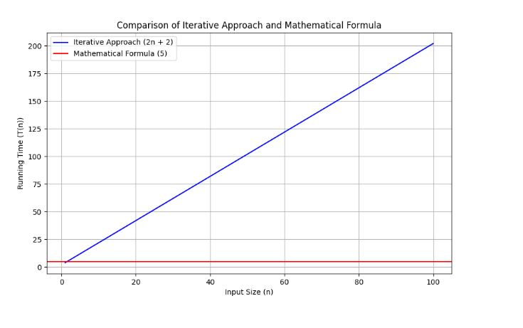

<h1>Analysis of algorithm</h1>
<p>When solving a problem like finding the sum of the first n natural numbers, we can approach it in multiple ways. To determine which approach is more efficient, we can't depend solely on measurements (like running the code on a machine and calculating time taken for execution for each approach) because these measurements depend on several factors, such as:</p>
<ul>
	<li><strong>Machine Type:</strong> Different machines have different processing capabilities. A more powerful (and expensive) machine will generally perform tasks faster than a less powerful (and cheaper) one.</li>
	<li><strong>Programming Language:</strong> Some programming languages (like C) are faster due to their lower-level operations and optimizations, while others (like Python) may be slower due to their higher-level nature and additional abstractions.</li>
	<li><strong>Load:</strong> depends on load that current machine is handling while executing programs</li>
</ul>
<p>Because of these variables, it's essential to use theoretical or mathematical analysis, known as asymptotic analysis, to evaluate the efficiency of algorithms in a machine-independent manner.</p>

<h2>Asymptotic Analysis</h2>
<p>Asymptotic analysis involves evaluating the performance of an algorithm in terms of its time and space complexity as the input size n grows. This approach uses mathematical functions to describe the behavior of an algorithm, allowing for a comparison that is independent of machine and language specifics.</p>
<p>In asymptotic analysis, we focus on the order of growth of an algorithm's running time or space requirements as a function of the input size</p>
<p>The order of growth describes how the running time or space requirements of an algorithm increase as the input size n increases.</p>
<p>Let's take an example and represent each approach in terms of order growth expressions</p>
<p><strong>Example : </strong></p>
<ul>
	<li>Mathematical Formula:</li>

```python
def fun1(n):
    return n * (n + 1) // 2
print(fun1(1000000))

```

<p>In this approach, finding answer involves only single calculation which takes constant amount of for any input n</p>
<p>let'a assume c1 time</p>

<p>Hence, order of growth expression can be represented as</p>
<p><strong>fun1(n)=c1</strong></p>
<p>c1 be the constant time for the computation.</p>


<li>Iterative Approach:</li>

```python
def fun2(n):
    total = 0
    for i in range(1, n + 1):
        total += i
    return total
print(fun2(1000000))
```

<p>In this approach, The loop runs n times and Each iteration performs a constant amount of work.let it be c2</p>
<p>let c3 be the constant time for initializing total to 0.</p>
<p>let c4 be the constant time for the final return statement.</p>
<p>Hence, order of growth expression can be represented as</p>
<p><strong>fun2(n)=c2n+c3+c4</strong></p>

<li>Quadratic Approach</li>

```python
def fun3(n):
    total = 0
    for i in range(1, n + 1):
        for j in range(1, i + 1):
            total += 1
    return total

print(fun3(1000))
```

<p>In this approach, The outer loop runs n times.</p>
<p>The inner loop runs i times for each i from 1 to n</p>
<p>let c5 be the he constant time for initializing total to 0.</p>
<p>let c6 be the constant time for each iteration of the inner loop.</p>
<p>let c7 be the constant time for the final return statement.</p>
<p>Hence, order of growth expression can be represented as</p>
<p>fun3(n)=c5+c6(n(n+1)//2)+c7</p>
<p>fun3(n)=c5+c6(n**2/2)+c6(n/2)+c7</p>
</ul>

<p>By representing the running times in terms of order of growth expressions, we can better understand the efficiency of each algorithm.</p>

<p>In asymptotic analysis, we focus on positive input sizes (n>0) and positive running time (T(n)>0).</p>
<p>This means we graph these functions in the first quadrant of a Cartesian coordinate system. By comparing the order of growth of different algorithms, we can predict their performance for large input sizes, regardless of the machine or language used.</p>
<p>In the above example, if we compare mathematical formula expression vs itertive expression in graph</p>
<p>Mathematical approach , <strong>fun1(n)=c1</strong></p>
<p>Itertive aproach , <strong>fun2(n)=c2n+c3+c4</strong></p>


<p>he blue line represents the running time of the iterative approach (2n+2).</p>
<p>The red horizontal line represents the running time of the mathematical formula approach (5)</p>

<p>This graph may represent like, for smaller value of n, itertive approach take less time due to its machine configuration</p>
<p>But for as n increase, itertive approach times is linearly increases, but formula approach takes constant time always</p>
<p>At some point of n, itertive will take more time than formula appraoch as seen in graph</p>
<p>Mathematically also we can prove</p>
<p>We know that, fun1,fun2>=0</p>
<p>To prove fun2>fun1 at some point n, let c1=5, c2=2,c3=2</p>
<p>2n+2>=5</p>
<p>2n>=5-2</p>
<p>2n>=3</p>
<p>n>=3/2</p>
<p>n>=1.5</p>
<p>n>=2</p>
<p>When n reaches greater than 2, itertive will take more time than formula based approch</p>
<p>This can be proved for any kind of machines or programming languages, because asymptotic growth expresssions will be common for all implementations</p>

<h3>Asymptotic Analysis Comparison</h3>

<div class="section">
    <h4>Comparing Two Approaches Theoretically Using Order of Growth Expressions</h4>
    <p>To compare the efficiency of two algorithms theoretically, we use their order of growth expressions. Given two functions \( f(n) \) and \( g(n) \) representing the time complexities of two algorithms, we can determine which one is more efficient by analyzing the limit:</p>
    <div class="formula">lim<sub>n → ∞</sub> g(n)/f(n)</div>
</div>

<div class="section">
    <h4>Rules for Determining Efficiency</h4>
    <ul>
        <li><b>If</b> lim<sub>n → ∞</sub> g(n)/f(n) = 0:
            <ul>
                <li>f(n) grows faster than g(n).</li>
                <li>Algorithm represented by g(n) is more efficient for large n.</li>
            </ul>
        </li>
        <li><b>If</b> lim<sub>n → ∞</sub> g(n)/f(n) = ∞:
            <ul>
                <li>g(n) grows faster than f(n).</li>
                <li>Algorithm represented by f(n) is more efficient for large n.</li>
            </ul>
        </li>
        <li><b>If</b> lim<sub>n → ∞</sub> g(n)/f(n) = c where 0 &lt; c &lt; ∞:
            <ul>
                <li>Both f(n) and g(n) grow at the same rate.</li>
                <li>Both algorithms have similar efficiency for large n.</li>
            </ul>
        </li>
    </ul>
</div>

<div class="section">
    <h4>Examples with Order of Growth Expressions</h4>
    <h5>Example 1: Iterative vs. Mathematical Formula Approaches</h5>
    <p>1. <b>Iterative Approach</b>:</p>
    <div class="formula">T<sub>iterative</sub>(n) = 2n + 2</div>
    <p>2. <b>Mathematical Formula</b>:</p>
    <div class="formula">T<sub>formula</sub>(n) = 5</div>
    <p>To compare these:</p>
    <div class="formula">lim<sub>n → ∞</sub> (2n + 2) / 5 = ∞</div>
    <p>Since the limit is infinity, T<sub>iterative</sub>(n) grows faster than T<sub>formula</sub>(n). Thus, the mathematical formula approach is more efficient.</p>
</div>

<div class="section">
    <h4>Example 2: Linear vs. Quadratic Approach</h4>
    <p>1. <b>Linear Approach</b>:</p>
    <div class="formula">T<sub>linear</sub>(n) = 3n + 4</div>
    <p>2. <b>Quadratic Approach</b>:</p>
    <div class="formula">T<sub>quadratic</sub>(n) = 5n<sup>2</sup> + 3n + 2</div>
    <p>To compare these:</p>
    <div class="formula">lim<sub>n → ∞</sub> (5n<sup>2</sup> + 3n + 2) / (3n + 4) ≈ lim<sub>n → ∞</sub> (5n<sup>2</sup> / 3n) = ∞</div>
    <p>Since the limit is infinity, T<sub>quadratic</sub>(n) grows faster than T<sub>linear</sub>(n). Thus, the linear approach is more efficient.</p>
</div>

<div class="section">
    <p>By using the limit:</p>
    <div class="formula">lim<sub>n → ∞</sub> g(n)/f(n)</div>
    <p>we can determine which algorithm is more efficient for large input sizes:</p>
    <ul>
        <li>If the limit is <b>0</b>, g(n) is more efficient.</li>
        <li>If the limit is <b>∞</b>, f(n) is more efficient.</li>
        <li>If the limit is a positive constant, both have similar efficiency.</li>
    </ul>
    <p>This method allows us to compare algorithms theoretically, focusing on their asymptotic behavior and ensuring efficient and scalable solutions for large input sizes.</p>
</div>

<h3>Simplified Asymptotic Analysis</h3>

<div class="section">
    <h4>Simplified Approach Using Order of Growth</h4>
    <p>Instead of performing detailed calculations every time, we can directly determine the efficiency of algorithms by focusing on their highest-order terms and ignoring constant factors and lower-order terms. This approach simplifies the comparison using the concept of <b>asymptotic dominance</b>.</p>
</div>

<div class="section">
    <h4>Steps to Simplify Analysis</h4>
    <ul>
        <li><b>Eliminate Constants</b>: Remove constant coefficients from the expressions.</li>
        <li><b>Ignore Lower-Order Terms</b>: Focus only on the highest-order term, as it dominates the growth rate for large <i>n</i>.</li>
        <li><b>Use Universal Order of Growth</b>: Compare the simplified expressions based on their highest-order terms.</li>
    </ul>
</div>

<div class="section">
    <h4>Universal Order of Growth</h4>
    <p>Here is the commonly used hierarchy of growth rates, from smallest to largest:</p>
    <ul>
        <li><b>Constant Time</b>: \( O(1) \)</li>
        <li><b>Logarithmic Time</b>: \( O(\log n) \)</li>
        <li><b>Logarithmic Time</b>: \( O(\log (log n)) \)</li>
        <li><b>Linear Time</b>: \( O(n) \)</li>
        <li><b>Linearithmic Time</b>: \( O(n \log n) \)</li>
        <li><b>Quadratic Time</b>: \( O(n^2) \)</li>
        <li><b>Cubic Time</b>: \( O(n^3) \)</li>
        <li><b>Exponential Time</b>: \( O(2^n) \)</li>
        <li><b>Exponential Time</b>: \( O(n^n) \)</li>
        <li><b>Factorial Time</b>: \( O(n!) \)</li>
    </ul>
</div>

<div class="section">
    <h3>Examples with Simplified Analysis</h3>
    <h4>Example 1: Iterative vs. Mathematical Formula Approaches</h4>
    <p>1. <b>Iterative Approach</b>:</p>
    <div class="formula">T<sub>iterative</sub>(n) = 2n + 2</div>
    <p>Simplified: <b>O(n)</b></p>
    <p>2. <b>Mathematical Formula</b>:</p>
    <div class="formula">T<sub>formula</sub>(n) = 5</div>
    <p>Simplified: <b>O(1)</b></p>
    <p><b>Comparison</b>: O(1) (constant time) is more efficient than O(n) (linear time). Therefore, the mathematical formula approach is more efficient.</p>
</div>

<div class="section">
    <h4>Example 2: Linear vs. Quadratic Approach</h4>
    <p>1. <b>Linear Approach</b>:</p>
    <div class="formula">T<sub>linear</sub>(n) = 3n + 4</div>
    <p>Simplified: <b>O(n)</b></p>
    <p>2. <b>Quadratic Approach</b>:</p>
    <div class="formula">T<sub>quadratic</sub>(n) = 5n<sup>2</sup> + 3n + 2</div>
    <p>Simplified: <b>O(n<sup>2</sup>)</b></p>
    <p><b>Comparison</b>: O(n) (linear time) is more efficient than O(n<sup>2</sup>) (quadratic time). Therefore, the linear approach is more efficient.</p>
</div>

<div class="section">
    <p>By simplifying the analysis:</p>
    <ul>
        <li>Eliminate constant factors and ignore lower-order terms.</li>
        <li>Focus on the highest-order term to determine the growth rate.</li>
        <li>Use the <b>universal order of growth</b> to compare algorithms.</li>
    </ul>
    <p>This method provides a quick and effective way to evaluate the efficiency of algorithms, ensuring that we can make informed decisions without performing complex calculations every time.</p>
</div>